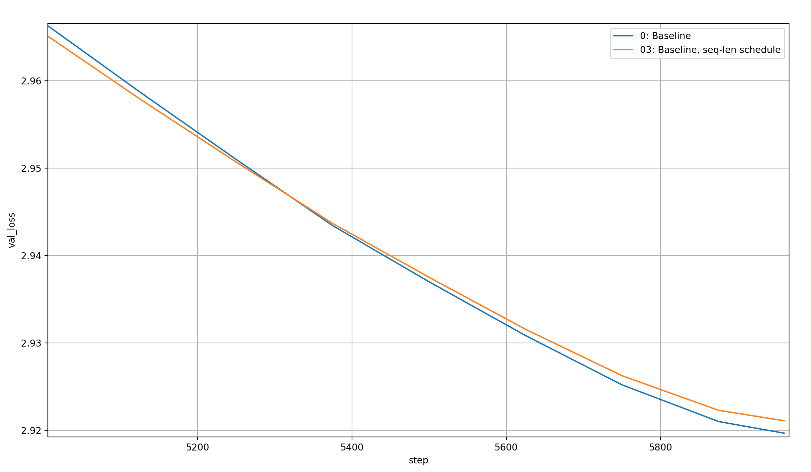
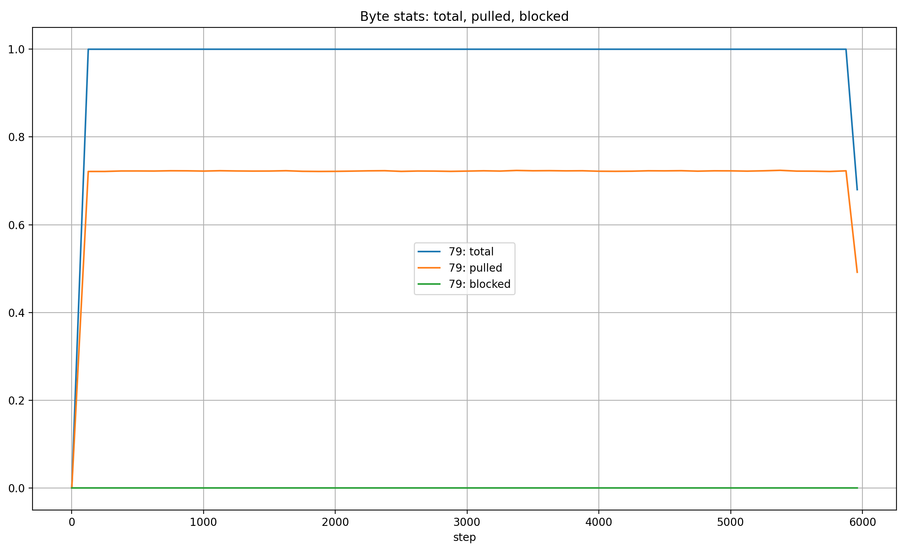
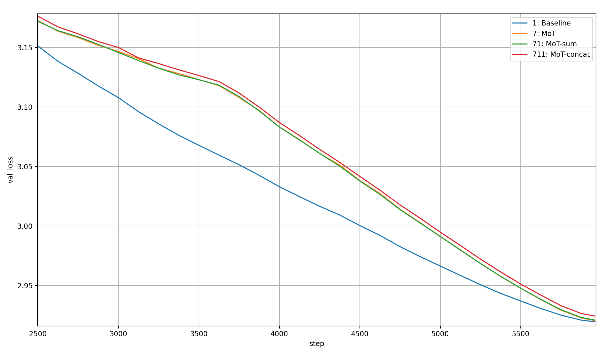
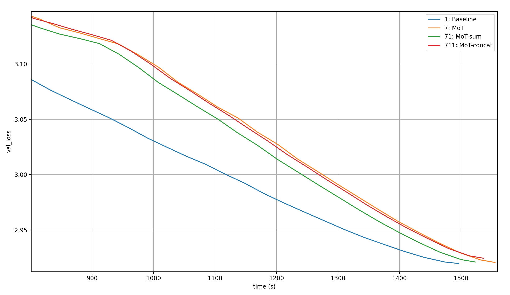

# Analysis

Analyzing the results as they come in

## 0

The original script.

## 1

The original script but with my dataloader, to see the performance difference it makes.

Performance over time:

Performance per step:

- There is no difference in per-step performance
  - Good sign for correctness of dataloader
- There is a very slight difference in timing
  - The dataloader isn't as slow as expected
  - But as expected, it does make a bit of a difference

## 7

I'll compare it to 1 as the baseline, so that the dataloader isn't a factor. Let's first look at the per-step and per-time performance of both over the full run.

Per step:

- The two are pretty similar
- There is a weird hump around step 3000-4000 in the MoT curve
- The MoT is slightly worse per step

Over time:

- Clearly, the MoT is way slower than the baseline
  - This is of course due to the additional re-shaping and the linear layer

Let's look more closely at the first and second half of the per-step plot. The first part:

- The two are neck-on-neck
- The baseline is slightly better most of the way
- Around step 1000, the MoT is slightly better
- Then it gets worse again, and fast

For the second part:

- The MoT's loss-curve flattens out, while the baseline's just keeps going
- But at around step 3500, there is a step change in the MoT loss curve and it bends down

This step-change is important, and fixing it would give me a huge boost. It looks like either a hyperparameter thing or some problem with the data.

Let's check out the two hyperparameters that follow a schedule: learning rate and sequence length. And let's normalize them to their maximum size so that they can both fit on the same plot.

This doesn't immediately look like the cause of the step change:

- The step change happens at around step 3500
- The learning rate starts decaying before step 2000
- The sequence length is constant for a long time before the step change happens, and only starts increasing after (at maybe step 3900)

So it might be some sort of threshold being reached for the learning rate, but it's still strange, especially because the final loss is very close (baseline: 2.919627, MoT: 2.920585 &rarr; the MoT loss is 1.00032812 times larger than the baseline loss, or ~0.033%).

## 71

I first want to try a modification of the MoT: instead of concatenating the tokens and bytes and applying a linear layer, I make sure that `byte_dim * bytes_per_token = token_dim = model_dim = 1024` and then sum the tokens and the concatenated bytes of each token. I'll call it MoT-sum. Let's compare this to both 1 and 7. And since I can immediately see that the curves for 7 and 71 are almost exactly the same, I'll just start with the zoomed in version of the late steps:

- Before step 2200 or so, the MoT is slightly better than MoT-sum, but afterwards, no difference is visible.
- Both follow the same strange shape, so it isn't *extremely* architecture dependent (though they are of course very similar)

Let's zoom in further at the end of the plot:

- The two are very close for a while, then diverge again
- The MoT is better than the MoT-sum, but the difference is tiny (final loss MoT: 2.920585, MoT-sum: 2.920994 &rarr; MoT-sum has a final validation loss 1.00014 times larger than MoT, so 0.014% higher)

Let's look at timing:

- MoT-sum is significantly faster than MoT
  - This is especially pronounced in the beginning
- The baseline is still faster than the MoT-sum

Let's zoom in a bit:

- MoT-sum is worse than the baseline the entire time
- But the real issue is again that weird camel bump

## 72

This is changed from 7:

- Removed the individual norms from the token- and byte-embeddings, and only normed after the FC layer that mixes in the bytes
- Lowered the learning rate of the byte_embeddings from 0.3 to 0.1

Looking back (from after experiment 79 which I will get to), I should have disentangled those changes; I might need to look at them at some later point.

Just looking at the time, 72 has a per-step time of 256.28ms; MoT-sum has 255.56ms, MoT 260.98ms. That's confusing; why should anything change vs. MoT? I might have made a mistake and will have to try the two changes individually later.

- The regular MoT is very slightly better
- But the difference is negliable, so I'll have to repeat the changes separately and properly

## 73

Changed from 71: instead of `norm(byte_embs + token_embs)`, I'm going `norm(byte_embs) + norm(token_embs)`

> Again, I'm writing this down after having done experiment 79, but at this point, I started registering my predictions

- Prediction: will be worse because model cannot itself determine the relative weight of token_embs and byte_embs

This modification makes performance worse than the original MoT-sum.

## 74

Changed from 73: `norm(byte_embs) * scalars[-1] + norm(token_embs) * scalars[-2]`

- Prediction: will be as good as 71 or better.
  - Issue of relative weight of token_embs and byte_embs is solved
  - But the token_embs and byte_embs themselves still get normed (which seems to have helped with tokens-only)

My prediction was wrong: this version of MoT-sum is actually worse than 71.

What I haven't tried is `norm( norm(byte_embs) * scalars[-1] + norm(token_embs) * scalars[-2] )`.

## 75

Changed from 72: Reduced token_dim to 896

- Precictions:
  - Faster but worse

Results (since the shape of the plots of 72 and 75 are basically identical and they're very close, I'll just show a zoomed in version), starting with per-step:

Surprisingly, this is actually better! To me, that points to the Fully Connected layer that projects from the concatenated tokens and bytes into the model dimension being under-tuned. Which makes sense because if `bytes_per_token=16, byte_dim=64, token_dim=1024`, the weight will have shape `1024 x 2048`. That's pretty large (though the expansion factor in the MLPs is also large, so I'm not entirely sure that this makes sense).

That gives me a hint for two next things that I could do:

1. Reduce the dimensions so that the byte-mixin weight has shape `1024 x 1024`; so `byte_dim=32, token_dim=512`
2. Tune the learning rate

Let's look at the time, too:

The reduced `token_dim` speeds up the training a little bit, which is nice.

These results make me curious about two further comparisons: 1) comparison to 7 (the original MoT), because it's better than 72 and thus a better baseline, and 2) comparison to 71 (the best MoT-sum), because that's also pretty good and very fast (for a MoT).

First off, the comparison to the original MoT:

The original MoT is slightly better than this one, but I also screwed up and did the hyperparameter tuning at the same time. I'd like to see a comparison between the MoT with reduced `token_dim` but no tuned hyperparameters and the original MoT. Especially because per-time, the comparison looks very different:

75 is clearly much faster than 7.

Now the comparison to 71, the original MoT-sum:

Both are equally fast, but MoT-sum is slightly better. However, the difference is tiny and it might be more promising to stick with the normal MoT, for two reasons: 1) I can undo the hyperparameter-tuning that made it worse, and 2) I can further reduce the `token_dim` for the MoT while it's fixed for MoT-sum. The previously proposed MoT-sum variant where I apply a linear layer to the bytes before summing might be worth a try though.

Looking back again, I was thinking about the strange hump in the loss curve of all MoT-variants again, and making this plan:

- Next steps:
  - [ ] Increase Batch size (I saved a little bit of memory)
  - [ ] Tune hparams, especially for the byte_mixin (Prio 4)
  - [x] Experiment with increasing the un-masked attention window for both the base & the MoT (Prio 3)
  - [x] Change lr schedule (Prio 2)
    - warmup_frac = 1 - cooldown_frac
    - Do WD instead of SD as it is now (and not WSD, this ain't production material)
  - [x] Shuffle the data; maybe there's a problem where there are a bunch of tokens that suck for the MoT and that's why the curve bends so strangely? Actually that should be theory number 1, because neither the (Prio 1)

## 01

Changed from 0:

- Changed from SD schedule to WD schedule
- Increased cooldown_frac from 0.7 to 0.95
- warmup_frac = 1 - cooldown_frac

Expectations:

- I'm really 50/50 if it will work better or worse than the original
  - On the one hand, I read that WD is strictly better than SD
  - On the other hand, modded-nanogpt is pretty well tuned already, so who knows?
  - Also, I don't know if the WD results hold for Muon at all
- It might work better for the MoT, if the learning rate is the cause of the strange break in the loss curve of the MoT variants

(The above are my original notes, below are the ones from after 79)

I was a bit dumb doing this comparison starting from 0 instead of 1, but since the experiments were a failure anyway it's fine

The adjusted learning rate schedule makes the run worse; but it's especially interesting *how* it does it. First, 01 is a lot worse than 0, then it's slightly better, and then noticably worse again. That's like a slightly different version of the MoT-loss-curves! That's a big sign that the issue with the MoT is learning-rate related.

I won't make the comparison over time because the difference is tiny.

## 76

Changed from 75:

- Same learning rate schedule as [01](#01)

Clearly, this learning rate schedule makes things worse for the MoT, too.

## 02

What I originally wrote:

Changed from 0:

- Randomly shuffled files (with fixed seed)

Expectations:

- I think that this likely won't change much

My thought process was that the strange hump might be caused by some kind of data issue; the dataloader in modded-nanogpt loads one file after the other, so the thought was that it would load a file with data that worked well, then one with data that has some issue, and then another good one (the data order is fixed). To find out, I shuffled the training data. The actual target is the MoT (which will come below), this run was just for comparison (in case the data-shuffling caused some sort of change in both runs). Here you can see the results over time:

Barely a difference is visible.

Zoomed in, we can see that the shuffled data actually underperforms the original data order (I assume that that's just random chance; after all, the model initialization is also changed).

## 77

What I origianlly wrote:

Changed from 75:

- Randomly shuffled files (with fixed seed)

Expectations:

- I'm at ~80% that this will significantly change the shape of the loss curve
- That's because my leading theory for why the plot curve looks like shit is some data problem (that I should look into later)

And here are the results:

Shuffling changes absolutely nothing for the MoT except for random noise.

After this surprising (to me) result, I decided to do two things:

1. Test if the issue is related to the sequence length
    - I had previously trained a MoT on ~50B tokens
    - It had significantly lower training and validation loss than the token-only baseline
    - It was modified from an older version of modded-nanogpt (medium)
    - Specifically, the sliding window mask was removed
    - So I thought that that might be the issue
    - And I wanted to test increasing the sequence length earlier just to see what the effect would be (not the most rigorous test, but easy to do and a decent proxy for whether or not this idea was promising)
2. Check a few other statistics
    - First off, making sure that the files were actually shuffled
    - Secondly, checking the number of total bytes since the last validation step, as well as the number of bytes that were pulled and the number of bytes that were used to block context from another document in the same sequence. This was to check out a potential data-statistic that is unique to the MoT and might differ over the course of training

## 03

First off, changing the sequence-length (I changed the schedule; looking back, I don't know why I didn't just choose the maximum sequence length the entire time instead of a weird schedule, but whatever, this is still valuable data). Here's what I wrote:

Changed from 00:

- Changed seq-len schedule to `math.sqrt(x * (2 - x))`

Expectations:

- Lower val-loss than 00 (slightly)
- Slower than 00 (significantly)

Here is the plot of the updated sequence-length schedule, compared to the default (cubic) schedule:

The new sequence length is always higher than the default one except in the very beginning and end. So what are the results?

Above is almost the entire plot (only the first few step are cut off). It shows that the new schedule learns more over almost the entire run (per step, not per time-step; I'll come to that). However, that breaks down in the very end. Let's look more closely at that:

The run with a higher sequence length throughout training does worse than the original one. Huh? I guess this is mostly a question of hyperparameter tuning (but also, I should try a modded-nanogpt run going in the other direction; maybe a constant low sequence length followed by the original cubic schedule but in shorter time?).

Just as a sanity check, let's look at the time, too:

Yeah, the faster sequence length growth makes the run way slower (as expected) and worse. Now, most likely the MoT will also be worsened by this new sequence length schedule. But will it remove the loss hump?

## 78

What I wrote:

Changed from 75:

- Changed seq-len schedule to `math.sqrt(x * (2 - x))`

Expectations:

- Lower val-loss than 75
- Slower than 75
- Interesting is comparison to normal modded-nanogpt but with the new schedule

The new sequence length schedule changes nothing about the loss hump, but it does reduce final performance of the model. This is unlikely to be the reason for the strange loss hump.

So the last thing I did was capture a few statistics.

## 79_mot-in_toks_valemb

Changed from 77:

- Log current file (from dataloader), total_bytes, pulled_bytes, blocked_bytes

- All the byte stats are very consistent (the lower values at the start and end are just because the number of steps in between is lower, which I didn't correct for)
- The number of pulled bytes is consistently at slightly above 70% of the total bytes
- The number of blocked bytes is around 0.0025%
- The files are actually shuffled
- So my favorite hypothesis of something being wrong with the data is disproven; which is very good in a sense, but bad in another because now I don't know what to fix

## NEXT STEPS (2025-07-25)

Here is the experiments I had planned before creating this document:

- [ ] Do MoT by addition, but apply linear layer to the bytes before so that they can be mixed
- [x] Zero-init bytes?
- [ ] Try it with `bpt=8, byte_dim=128` and `bpt=32, byte_dim=32`
  - So many bytes are pulled that it might hurt
  - On the other hand, doing it more might give more of an advantage
- [x] Decrease `token_dim` (and maybe `byte_dim` too?) but increase expansion factor in MLP.
- [x] `token_dim=512, byte_dim=32`; then only concatenate, no sum or FC layer
  - This should lead to a very clean gradient to both the token- and byte-embeddings
  - In a sense, it lets the actual transformer backend handle the byte mixin.

Now, I would add the following:

- [x] Independently test norm changes and hyperparameter changes

The plan:

- Add `num_params` to the end-printout
- Runs:
  - 711: MoT by concatenation (`token_dim=512, byte_dim=32`)
  - 712: If 711 works well, increase the expansion factor of the MLP until the number of parameters is similar to the baseline again

## 711

MoT by concatenation (`token_dim=512, byte_dim=32`); Hyperparameters: (`lr_tok=0.3, lr_byte=0.1`) -> still likely suboptimal (at least for the default MoT 7, it worsened performance).

Predictions:

- Should be pretty fast; only thing that makes it slower than 1 (baseline with my dataloader) is the concatenation ops
- Should be pretty good; token embeddings of size 512 are not too bad, and the gradient signal isn't blocked in any way, so that alone should be okay; and the bytes should only add to that (oooooh, that would be a nice baseline: replace the bytes with a single learned vector).
- I don't think it will remove the loss hump, simply because I'm now convinced that that's mostly due to a change in optimal hyperparameters (or the fundamental structure of mixed token- and byte-embeddings, but that seems less likely)

Here is the validation loss over the steps, compared to the original MoT (7), the MoT through addition (71), and of course the baseline (1):

711 is very clearly the worst of all the baselines that matter. But maybe it's so much faster that it's still worth looking into?

711 is actually sufficiently much faster than 7 (MoT) that it would be a good, cheaper alternative. But 71 (MoT-sum) crushes it; it's not only better per step, but also faster. Of course, the baseline is still better in every way.

Alright, so I should dismiss this idea. However, I had run another experiment in parallel: [712](#712).

## 712

This is like [711](#711) but the MLP hidden dimension has been increased by 768. This is motivated by the fact that reducing the `token_dim` reduces the total number of parameters quite significantly. I wanted to make up for that by increasing the MLP hidden dimension and see how it goes.

Number of parameters:

- [Baseline (0)](#0): 454_496_336
- [MoT-concat (711)](#711): 428_779_408
- [MoT-concat with increased hidden dim (712)](#712): 453_945_232

So the total number of parameters still doesn't quite match the baseline. Of course, embedding parameters and MLP parameters aren't perfectly comparable: embeddings are sparsely activated while the MLP works on every token in every batch. A fairer comparison would probably be to increase the number of experts in an MoE while keeping the number of active parameters constant, but I'm not about to implement that (not to mention that it would be a radical architecture change that would make the comparison worse). In fact, even then, the MoE has to be held in GPU memory, while the embeddings can be offloaded to another device, because their inputs are one-hot they can thus be fetched via a simple table lookup instead of

So here is the comparison to the [Baseline](#1) and [MoT-concat](#711) per step:

And damn! This crushes. However, it still has the strange loss hump, and again: MLP parameters and embedding parameters aren't super comparable. That last fact is very visible when we compare performance over time:

It's ridiculously much slower. This is clearly not the way to go.

## 713

Variation of [#711](#711) where I switched the order of MLP and Attention.

That might sound crazy, but hear me out: normally, Attention comes before the MLP because embeddings only depend on a single token, so if we applied the first MLP to them it would just be an extension of the embedding layer. This means that the number of different inputs that the MLP can possibly see is limited by the vocabulary size, which in turn limits the MLP's contribution to generalization to different sequences. But if we put Attention first, it will mix the tokens in a sequence and allow the subsequent MLP to perform its calculation based on the entire sequence of tokens, allowing it to contribute to understanding previously unseen sequences.

But I concatenate the byte-embeddings to the token-embeddings; and the byte-embeddings are pulled, meaning that on average a little more than 70% of them actually belong to previous tokens! In this way, the embeddings are already sequence-dependent, and putting the MLP first would allow it to effectively combine a (very localized) attention operation with the normal MLP job. Maybe it's worse at both than an independent Attention and MLP layer, but at least it is less likely to waste compute.

This mixing might actually be especially relevant for MoT-concat (and maybe MoT-sum, too): at the input, bytes are appended along both the model-dimension and the sequence dimension; but the ordering along the model-dimension is the local ordering and along the sequence dimension the global ordering (speaking loosely). This, to me, means that mixing along the model-dimension first (via the MLP) and then along the model-dimension (via Attention) is the correct order, because mixing along the sequence-dimension first might lead to collisions between bytes that are in the position that they're in for a random reason. And yes, the FC layers in Attention can probably handle this, but it's a lot to put on them, and I'd at least like to try out the alternative.

Predictions:

- It's likely slightly worse than [#711](#711); and if it's better, only slightly so
- The speed will hopefully be unchanged

This variant is noticeably worse than [#711](#711) per step (and I've looked, it takes approximately the same amount of time, minus random variation). I'll dismiss it.

## 71011, 71012, 71013, 71021, 71022

Variations of [#71 (MoT-sum)](#71).

In 71, `lr_tok=0.3, lr_byte=0.1`; in [#7 (MoT)](#7) vs. [#72 (MoT with `lr_byte=0.1`)](#72), this made things worse. So I'll tune the learning rates a bit for now.

Here are the learning rates:

| Experiment number | `lr_tok` | `lr_byte` |
| --- | --- | --- |
| 71 | 0.3 | 0.1 |
| 71011 | 0.3 | 0.3 |
| 71012 | 0.3 | 0.4 |
| 71013 | 0.3 | 0.2 |
| 71021 | 0.4 | 0.3 |
| 71022 | 0.2 | 0.3 |

So #71011 the actual baseline MoT-sum, which #71 isn't (yeah the numbering system is completely fucked now, it grew over time...). The others are just variations. I have no predictions for these runs, I'll just run them and look at the results.

I will only analyze them over the steps, because the learning rate should have no impact on timing, so any difference in speed is random (and yes, I realize that comparing the results of a single run also introduces a lot of randomness).

They are all still worse than the baseline [#1](#1), so I will spare you that. Since only a very zoomed-in view shows any differences at all, here's one:

The main thing to take away from this is that decreasing `lr_token` is a bad idea. As for the other settings, let's look at them in detail:

Two takeaways:

1. Very, very clearly, increasing `lr_byte` is the way to go; I should tune this more
2. By a slight margin, #71021 beats out #71011, so `loss(lr_token=0.4) < loss(lr_token=0.3)`; but the difference is so small that I wonder if the optimal value is between these two, or if it's just random chance and doesn't matter

So my next learning-rate tuning experiments should be:

- Testing norms (#7104*), especially `norm( lambda_1 * norm(tok_embs) + lambda_2 * norm(byte_embs) )`; but maybe normalize the lambdas and print them in the end to get some useful information about them; take #71011 as baseline, so that the learning-rates are like in the original modded-nanogpt
  - [x] #71041: `norm( lambda_1  * norm(tok_embs) + lambda_2 * norm(byte_embs) )`
  - [x] #71042: `norm( lambda_1 * norm(tok_embs) / (lambda_1 + lambda_2) + lambda_2 * norm(byte_embs) / (lambda_1 + lambda_2) )`
  - [x] #71043: same as 71042, but initialized to `lambda_1=0.99, lambda_2=0.01`; initialize as tokens only (without causing an issue with gradients), let the model learn the right amount of byte-mixin itself
  - [x] #71044: same as 71042, but initialized to `lambda_1=0.6, lambda_2=0.4`, because (spoiler alert) that's what they end up at when initialized to `lambda_1=0.5, lambda_2=0.5`
- Testing combined `lr_tok` and `lr_byte` changes (#7103*)
  - [x] #71031: `lr_tok=0.4, lr_byte=0.4`
  - [x] #71032: `lr_tok=0.35, lr_byte=0.4`
  - [x] #71033: `lr_tok=0.4, lr_byte=0.45`
  - [x] #71034: `lr_tok=0.35, lr_byte=0.45`
  - [x] #71035: `lr_tok=0.4, lr_byte=0.5`
  - [x] #71036: `lr_tok=0.35, lr_byte=0.5`
- Testing a linear layer on the bytes right before the sum between the bytes and tokens
  - [ ] #71051

I can then combine the best norm combination with the best learning rate combination. Afterward, I will try changing the number of bytes per token, for either more or fewer pulled bytes.

## 71031, 71032, 71033, 71034, 71035, 71036

Another learning rate ablation of [#71](#71) with the following values:

| Experiment number | `lr_tok` | `lr_byte` |
| --- | --- | --- |
| 71031 | 0.4 | 0.4 |
| 71032 | 0.35 | 0.4 |
| 71033 | 0.4 | 0.45 |
| 71034 | 0.35 | 0.45 |
| 71035 | 0.4 | 0.5 |
| 71036 | 0.35 | 0.5 |

Let's first look at steps 1500 to 6000:

They are clearly all very close, and they still suffer from the loss hump. To be able to make up any differences between these, I'll zoom in more closely:

Two setting come out on top, essentially sharing the first place:

- #71032: `lr_token=0.35, lr_byte=0.4`
- #71036: `lr_token=0.35, lr_byte=0.5`

That the third place is taken by `lr_token=0.35, lr_byte=0.45` tells me that `lr_token` shouldn't be turned up beyond `0.35`. As for the choice between the `lr_byte` values, the trend is much less clear to me.

Let's compare the two top settings to the best setting from before, [#71012](#71011-71012-71013-71021-71022), and to the baseline:

They close the gap to the baseline almost halfway. That's pretty decent!

## 71041, 71042, 71043, 71044

Variations of [#71011](#71011-71012-71013-71021-71022) (because #71011 has both learning rates at `0.3`, like in the original modded-nanogpt).

Let's first look at the per-step validation losses:

Clearly, norming both embeddings individually and then their weighted sum again is superior to just norming the embeddings' sum. The only time this is not true if when the lambdas are initialized to `lambda_token=0.99, lambda_byte=0.01`. Also clearly, norming the lambdas to sum to one is also helpful. Initialization schemes other than equal weight to tokens and bytes are pointless.

To get a fuller view of the results, let's also look at loss over time (because additional norms etc. are added):

Unfortunately, the norms add a significant amount of time to the runs; especially the norming of the lambdas. So per unit of time (the measure we ultimately care about in a speedrun), the best run is with a weighted sum of normed embeddings, but without norming the lambdas.

Next up, I should perform an experiment with this norm setting and the best hyperparameter setting I found so far. I'm curious about those hyperparameters though; is `0.3` better for `lr_token` or `0.35`? And which of `0.4`, `0.45`, and `0.5` is the best value for `lr_byte`? Let's just try all combinations in #71061-71066.
